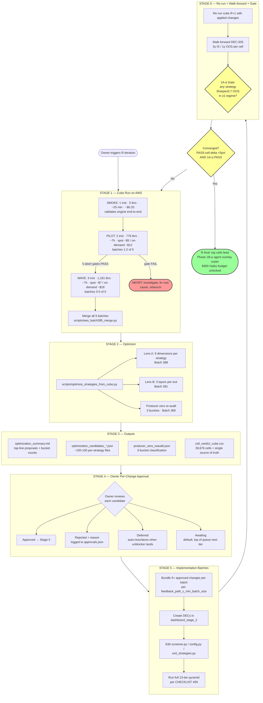
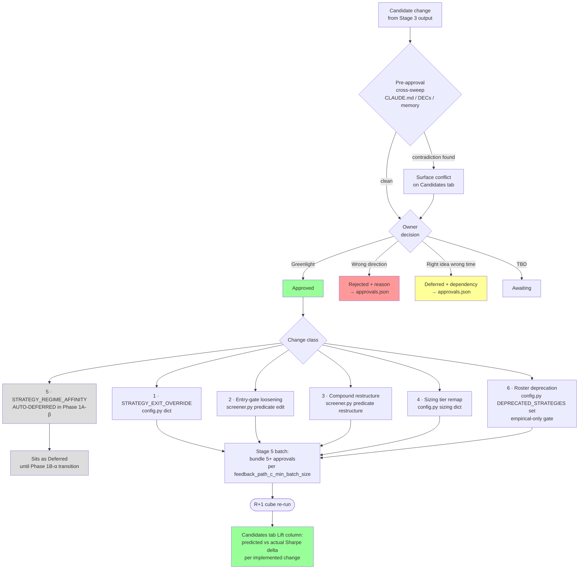

<!-- Source: per CHECKLIST #77 canonical-source; Council 287 B1233 2026-07-07 doc-sync sweep -->

<!-- 🟢 COUNCIL 278-287 SYNC BANNER (B1233 2026-07-07) — READ FIRST BEFORE THIS DOC -->
> **Doc-sync status:** This document may contain references stale as of 2026-06-27 or earlier. The current state below overrides any stale references in the body until the next full-rewrite.
>
> **Current canonical values (as of 2026-07-07 B1231):**
> - `len(ALL_STRATEGIES) = 219` (was 220 pre-B1189 DELETE of dxy_headwind_multinational_short; was 221 pre-B874)
> - `STRATEGIES_DISABLED_MISSING_PRODUCER = set()` (was `{dxy_headwind_multinational_short}` pre-B1189)
> - Active strategies for Phase 1A-β cube: 219; cube cells 219×26 = 5,694
> - Test count: **858 passed, 2 skipped** on `test_unit.py + test_integration.py`
> - **CHECKLIST items:** #1–#157 (added #151-#157 in Councils 279-285)
> - **LEARNINGS lessons:** through L202 (added L197-L202 in Councils 279-285)
> - **Latest batch:** B1231 (Council 285)
>
> **Recent Council 278-287 milestones (chronological):**
> - Council 278 (B1188-B1204): 40 SKIP strategies loosened per CSV recommendations
> - Council 279 (B1205-B1210): 11 silent misses remediated + L197 + CHECKLIST #151-#153
> - Council 280 (B1211-B1213): News coverage refined (84.2%) + CHECKLIST #154 codified
> - Council 281 (B1214-B1216): short_interest_pct producer bug + institutional 30% gap surfaced
> - Council 282 (B1217-B1219): Cross-audit 192 strategies + CHECKLIST #155
> - Council 283 (B1220-B1223): 5 more producer audits + comprehensive report
> - Council 284 (B1224-B1228): All 25+ producers audited + historical 2020-2023 spot-check + L201 + CHECKLIST #156
> - Council 285 (B1229-B1231): 2 critical bugs FIXED with graceful degradation + L202 + CHECKLIST #157
> - Council 287 (B1232-B1236 in progress): Stage 4 walks archived + doc-sync sweep
>
> **Stage 4 walks: ARCHIVED 2026-07-07 to `archive/2026-07-07-stage-4-walks-complete/`** (Council 121+ 2026-06-27 owner-approved completion). Any `STAGE_4_*.md` reference in this doc now points to archived location.
>
> **Producer coverage (all 25+ producers audited Councils 280-284):**
> - news_sentiment 84.2% / short_interest_dtc 97.7% / **short_interest_pct 0%** (bug; graceful-degradation fix in B1229) / pead 85% / insider 18.8% (event-rarity) / **institutional_signal 85%** (B1230 corrected from B1216's 30% misattribution) / congressional 67.7% / sec_edgar 97.7% / search_volume 99.2% / index_rebalance 10.5% (event) / earnings_yoy 78.9% / cot_positioning 100% / cross_asset 100% (5 fns) / calendar_effects 100% / macro_events 100% / OHLCV-derived (chart_patterns/technical/dec513/multi_timeframe/cross_sectional/ict_producers/volume_profile/smc_ict/pairs_trading) all 100% (bounded by ~84% OHLCV cache)
> - **Critical historical finding (B1227):** news_sentiment 0% in 2020; short_interest_dtc 0% in 2020; institutional 0% in 2020-2021. Backtest interpretation must annotate producer coverage TIMELINE.
>
> **Sprint 5 tickets queued (post-Council 285 priorities):**
> - S5-B1214-SHARES-OUTSTANDING (HIGH; 1 strategy; 1d) - remove B1229 fallback when data ships
> - S5-B1216-INSTITUTIONAL-13F (MED after B1230 correction; 1 strategy; 1-2d) - expand T1a persistence file
> - S5-B1212-SECONDARY-NEWS (MED; 6 strategies; 2d) - Finnhub/AlphaVantage fallback
>
> **Comprehensive coverage report:** `output_audit/PRODUCER_COVERAGE_COMPREHENSIVE_REPORT.md`

---

# Phase 1A-beta Cube Optimization Workflow

**Locked 2026-05-28** (owner directive: "Lock the above. ... Create a new reference md file").
**Updated 2026-06-17 (B887; pre-R5 doc-sync)** — strategy/exit counts refreshed to live values (**219 registered / 218 active strategies / 26 exit methods / 39,676 cells (5,668 per regime)**; 1 disabled-missing-producer = dxy_headwind_multinational_short per Batch 372); roster churn since B572: +14 Class 7 NEW (B603/B605/B607/B636/B645/B685/B686/B709 — pead/news/52w-low/flag-bear-retest/3-black-crows/r3-blowoff/3 chart-pattern mirrors/2 PEAD restores/inverted-cup) − 14 deletions (B620/B682/B687/B722/B874 — squeeze-event-only/BR-15/EV-3/EV-4/EV-7/T5-T4-SHORT-dup/hull-rsi-short/po3-htf-aligned ×2/camarilla-rsi-obv ×2); 5 Stage 5 SWAPs applied (B835/B886: williams_r_oversold + institutional_cluster_long + stochrsi_oversold + po3_bullish + cpr_narrow_bullish all migrated to breakeven_plus_trail per B834 R4 cube verdicts). B887 supersedes "**Updated 2026-06-02**" snapshot. R5 paused pending B883 triage audit completion (current as of B887).

**Status.** Canonical reference for how (strategy × exit × regime) cube data flows from a Phase 1A-beta cube run through optimization → owner review → implementation → re-validation → the 1A-α owner gate. Authoritative across re-run iterations (R3 → R4 → R5 → R6…). Stage 1 (the AWS cube run) is the only stage that is environment-specific; Stages 2-6 are platform-agnostic and re-used on every iteration.

**R-iteration goal (owner directive 2026-06-02):** Each R-cycle (R4, R5, R6, …) is an OPTIMIZATION pass on (strategy × exit) cells. R4 produces baseline cell verdicts under all OPT-A/B/C/D + producer fixes (B556/B559/B561). Owner reviews + approves changes from the Stage 3 outputs. R5 re-runs with those changes and produces DELTA cell verdicts. Iterate until cell verdicts stabilize (PASS-cell count delta < 5% iter-over-iter) AND 1A-α gate passes (≥1 strategy with OOS Sharpe ≥ 0.7 in ≥1 regime). **Top (strategy × exit) combinations from the converged cube feed Phase 1B-α agent overlay roster.**

---

## Workflow at a glance

End-to-end flow from a cube run to the Phase 1B-α handoff. Third-person reader entry point.



**One-line summary:** R4 produces cube → optimizer surfaces ~100-150 per-strategy change candidates → owner approves per-change → Stage 5 implements 5+ at a time → R5 cube measures the delta → loop until 1A-α gate opens → top cells deploy to Phase 1B-α.

---

## Source attribution (per CHECKLIST #77)

- **Owner directive 2026-05-28:** "We need to view the cube at a strategy×exit cell level only, not aggregated. Optimize strategies and exits as per earlier frameworks."
- **Unified view locked** through owner Q&A across 2026-05-28 turns (Stages 1-6 + dashboard expectations).
- **Underlying script SSOTs:**
  - `scripts/optimize_strategies_from_cube.py` — Batch 388 (9 dimensions per-strategy) + Batch 391 `analyze_exit_methods()` (3 layers per-exit) + Batch 389 `producer_zero_reaudit()` (3-bucket quiet-strategy classification including COMPOUND_RESTRICTIVE).
  - `scripts/aws_batch395_merge.py` — Batch 395 (5-AWS-batch merge + inline cube rebuild per Batch 359).
  - `scripts/rebuild_cube_from_trade_log.py` — Batch 359 (fallback cube rebuild from trade_log + OHLCV cache; called by merge inline; usable standalone).
  - `backtest/engine/exit_strategies.py::run_exit_comparison` — cube engine.
  - `scripts/build_dashboard_phase_1a.py` — dashboard build (Sprint 6.5, Batch 177).

## Core principle (do not violate)

**Unit of analysis: `(strategy × exit_method × regime)` CELL.** Live as of 2026-06-17 (B887 doc-sync; pre-R5): `len(ALL_STRATEGIES) × len(EXIT_STRATEGIES) × 7 regimes = 219 registered / 218 active × 26 × 7 = 39,676 cells` (5,668 per regime). No batch-aggregated PnL anywhere. Aggregation is the trap; cells are the answer (`feedback_strategy_x_exit_cell_analysis.md`).

Counts drift over time as strategies/exits get added; always re-derive from `len(ALL_STRATEGIES)` + `len(EXIT_STRATEGIES)` at iteration start (`feedback_doc_count_drift_must_be_test_pinned`). Recent additions:
- Batch 467 P10 +2 news strategies
- Batch 487 SM1 +10 smart-money sleeves + SM2 +1 exit method (`smart_money_reversal` = 26th exit)
- Batch 507 M6 +2 YoY-growth PEAD sleeves
- Batch 519 P15 +2 short-interest sleeves (`squeeze_setup_long` + `short_borrow_trap_avoid`)
- Batch 531 P17 +2 SEC EDGAR sleeves (`activist_13d_long` + `m_and_a_target_long`)

DEC-426 5-Gate validity per cell: `n ≥ 30`, `p < 0.05` Bonferroni-corrected over 5,668 cells/regime (B887 live count), `PSR ≥ 0.95`, `t ≥ 3.4`, `R:R ≥ 2.0`. CLAUDE.md 11 criteria layered on top per cell.

No a-priori pruning (`project_no_apriori_strategy_pruning.md`): a strategy may be deprecated only if its 26-exit cube row shows 0 PASS cells in any regime AND 0/26 exits fire `n ≥ 30` in any regime.

---

## Stage 1 — Cube run

**Action.** Run Phase 1A-beta engine across the full universe (1,937 tickers × ~4y 2022-05 to 2026-04 × 218 active strategies × 26 exits = 39,676 (strategy × exit × regime) cells; B887). 5-batch AWS orchestration via `scripts/aws_batch395_*.py` is the canonical execution path; single-machine Hetzner remains the fallback.

**R4 launch flow (2026-06-02 — current iteration):**
Post-Batch-532 phased PILOT → WAVE structure per `feedback_monitor_intermediate_counts` (R3 burned 10h before anomalies surfaced; phased approach catches problems early):

| Phase | Batches | Wall (est) | Spot cost (est) | Gate |
|---|---|---|---|---|
| **SMOKE** | 1 instance, `--smoke-tickers` 5 names | ~25min | ~$0.15 | Engine boots + produces trades + self-terminates |
| **PILOT** | 2 instances (batch_1 + batch_2 of 5) | ~6.8h | ~$4.80 | 5 abort gates via `scripts/phased_r4_run.py --phase pilot` |
| **WAVE** | 3 instances (batches 3-5) | ~6.8h | ~$7.20 | Final cube assembly post merge |
| **Total** | 5 batches, 1,937 tkrs | ~13-15h end-to-end | **~$12-15** | Within $25 budget |

**Cost reduction vs R3 baseline:**
- R3 (pre-OPT, on-demand, workers=12): ~$20-25 / 5h per batch
- R4 (post-OPT, spot, workers=4): ~$12-15 / 6.8h per batch
- Spot pricing ~2.5x cheaper offsets workers=4 slowdown; net ~6x cost reduction

**SMOKE-1 lesson (2026-06-02):** workers=12 default OOM'd at insider bulk feed load (12 workers × 1M-row Quiver insider parquet + 388-ticker ohlcv_dict per worker exceeded c7a.4xlarge 32GB RAM). **R4 uses `--workers 4`** (validated by SMOKE-2 + SMOKE-3). If WAVE wall is too slow at workers=4, can ramp to workers=6 or 8 (~3-4 GB/worker × 8 = ~28 GB still under 32 GB).

**5 hard abort gates (`scripts/phased_r4_run.py` from Batch 532):**
1. `total_trades < 0.5 × baseline` — catastrophic trade-count drop (R3 had 7,191 → 361 from cap saturation pre-OPT; this gate catches at PILOT)
2. `zero_fire_strategies > 20%` — >40 strategies firing 0 trades (producer-zero cluster; B556/B559/B561 fixes should drop this)
3. `cap_saturation_rate > 0.20` — >5 strategies hit `max_candidates/day` ceiling on >20% of bars
4. `p17_signal_emission == 0` — 0 P17 SEC EDGAR sleeve fires (would mean wire-in broken OR decoded cache empty)
5. `det1_cross_platform_diff > 0.05` — Linux trade-count diff from Windows-local baseline >5% (platform-FP escape beyond known `rsi_14`)

### Stage 1 flow detail

```mermaid
flowchart LR
    Launch[Owner runs<br/>aws_batch395_launch.py<br/>--spot OR on-demand] --> S
    S[SMOKE batch<br/>5 tickers<br/>--smoke-tickers AAPL,MSFT,...]
    S -- engine produces trades<br/>+ self-terminates --> P
    P[PILOT batches 1+2<br/>776 tickers<br/>workers=4]
    P -- per-batch artifacts to S3:<br/>trade_log + trade_exit_detail<br/>+ skipped_trades + _COMPLETE --> G
    G{phased_r4_run.py<br/>5 abort gates}
    G -- PROCEED --> W
    G -- WARN --> WR[Owner review]
    G -- ABORT --> X([Stop · investigate])
    WR -- approve continue --> W
    W[WAVE batches 3+4+5<br/>1,161 tickers]
    W -- 5 _COMPLETE sentinels --> M[Merge<br/>aws_batch395_merge.py<br/>--upload-final]
    M --> CUBE[output_batch395_final/<br/>trade_log.csv<br/>trade_exit_detail.csv<br/>verdict_cube.csv]

    style G fill:#ff9
    style X fill:#f99
    style CUBE fill:#9f9
```



**Outputs (per batch, before merge):**
- `outputs/batch_N/trade_log.csv` (fires with `signals_at_entry` JSON)
- `outputs/batch_N/trade_exit_detail.csv` (cube rows: one per `trade × exit_method`)
- `outputs/batch_N/skipped_trades.csv` (gate-rejection reasons)
- `outputs/batch_N/_COMPLETE` (sentinel)
- `forensic/batch_N.json` (per-batch verdict from `aws_batch395_forensic_per_batch.py`)

**Merge (`scripts/aws_batch395_merge.py --bucket <name> --upload-final`):**
- Produces `output_batch395_final/trade_log.csv` + `trade_exit_detail.csv` + `skipped_trades.csv`.
- If cube file missing post-merge, inline call to `rebuild_cube_from_trade_log.py` regenerates it (Batch 359 path closes the legacy gap where `merge_batch_outputs.py` dropped trade_exit_detail).

**Dashboard view/expectations:**
- All 13 existing tabs (Overview / 1. Strategies / 2. Regime / 3. MAE/MFE / 4. Equity / 5. Walk-fwd / 6. Smart-$ / 7. Sector / 8. Skipped / 9. CircuitBreakers / Exits / Trades / Raw JSON) are STALE during run; do not regenerate until merge completes.
- **NEW Overview widget "Run Status"** consumes per-batch `_COMPLETE` sentinels + forensic JSON: shows `5/5 _COMPLETE`, per-batch wall-time, forensic verdict per batch (PASS/WARN/ABORT). Visible during run; settles when merge lands.
- **Refresh trigger (post-merge):** `python scripts/build_dashboard_phase_1a.py --source output_batch395_final`.

---

## Stage 2 — Optimizer

**Command:**
```bash
python scripts/optimize_strategies_from_cube.py \
    --input-dir output_batch395_final \
    --output-dir output_optimization_candidates_<YYYY_MM_DD>
```

**Two analytical lenses on the same cells (single script, single invocation):**

### Lens A — per-strategy 9 dimensions (Batch 388)

For each fired strategy + each quiet strategy:

| Dim | Question | Key memory / DEC |
|---|---|---|
| A | Entry-gate thresholds — which clauses are BINDING vs LOOSE? | DEC-422 |
| B | **Compound logic — AND-clause individual fire rates + pairwise correlations** | **← COMPOUND_RESTRICTIVE optimizations originate here** |
| C | Regime applicability — per-regime DEC-426 5-Gate verdict | CLAUDE.md #11 |
| D | Best exit pairing — best exit by Sharpe per strategy | shared with Lens B Layer 2 |
| E | Position sizing tier — Sharpe → tier mapping recommendation | CLAUDE.md sizing table |
| F | Universe filtering — per-sector / cap_band verdict | DEC-303 |
| G | Hold-duration limits — empirical hold-days distribution | DEC-521 |
| H | Cooldown / re-entry — post-stop re-entry behavior | DEC-018 |
| I | Macro overlay — per-macro-regime verdict | DEC-348 |

### Lens B — per-exit 3 layers (Batch 391 `analyze_exit_methods`)

| Layer | What it produces | Action implied |
|---|---|---|
| L1 — per-exit aggregate | Across all 218 active strategies (B887) that used each of 26 exits: aggregate Sharpe, PF, WR, n. Ranks exits with `n_strategies_paired ≥ 5` gate. | Top-5 = default-good exits for new strategies; bottom-5 = deprecation candidates only if L2 confirms 0 PASS cells anywhere. |
| L2 — per-(strategy × exit) cell verdict | Each cell `n ≥ 5`: Sharpe + DEC-426 5-Gate. PASS cells become `STRATEGY_EXIT_OVERRIDE` candidates. | Direct evidence for deployed config per strategy. Feeds Phase 1B-α winners list. |
| L3 — within-family variant ranking | `time_stop` (10d/20d/class_time_stop), `r_multiple` (2r/3r), `trailing` (5/10/15pct), `atr_trail` (1x/2x/mae_conditional/vix_conditional), `chandelier`, `breakeven`, `partial` (multi_tier_partial/hybrid_50pct_target). | Per-family default + per-strategy override. |

### Bucket classification (Batch 389 `producer_zero_reaudit`)

For quiet (zero-fire) strategies, three buckets:
- **PRODUCER_LAYER_ZERO_LIKELY** — gate keys' truthy emission absent from empirical signal corpus → producer-layer fix required.
- **COMPOUND_RESTRICTIVE** — individual clauses DO emit truthy, but the AND-compound never satisfies → Dim B compound restructure or Dim A threshold loosening.
- **SKIPPED_AT_ENGINE** — appears in `skipped_trades` → downstream gate (likely already removed by Batches 377/383/384/386; re-check binding gate).

Phase 1A-beta single-batch baseline (2026-05-26) showed ~106 COMPOUND_RESTRICTIVE strategies. Post-AWS-cube re-audit will produce the live count + per-strategy gate-keys table.

**Dashboard view/expectations:**
- All 13 existing tabs refresh against the merged AWS cube. Expected R4 counts (post-OPT + producer fixes): ~40-60k trades (vs R3's 29k due to BUG-61 ticker_strategy block-mode unlock + B556 SMC + B561 sector_history producer fixes), ~120-150 fired strategies of 218 active (B887; vs R3's ~85-100 from 185), ~39,676 cells computed.
- **NEW "Optimizer Status" widget on Overview** — last-run timestamp, input/output dirs, runtime, summary.md top-line proposals.

### Stage 2 flow detail

```mermaid
flowchart TB
    CUBE[Merged R{N} cube<br/>output_batch395_final/] --> OPT[scripts/optimize_strategies_from_cube.py]

    OPT --> LA
    OPT --> LB
    OPT --> PZ

    subgraph LA[Lens A — Per-strategy 9 dimensions · Batch 388]
        direction TB
        A[A · Entry-gate thresholds<br/>BINDING vs LOOSE clauses]
        B[B · Compound logic<br/>AND-clause fire rates +<br/>pairwise correlations]
        C[C · Regime applicability<br/>per-regime 5-Gate verdict]
        D[D · Best exit pairing<br/>per-strategy top exit by Sharpe]
        E[E · Sizing tier<br/>Sharpe → tier mapping]
        F[F · Universe filter<br/>per-sector / cap_band verdict]
        G[G · Hold-duration limits<br/>empirical hold-days distribution]
        H[H · Cooldown / re-entry<br/>post-stop behavior]
        I[I · Macro overlay<br/>per-macro-regime verdict]
    end

    subgraph LB[Lens B — Per-exit 3 layers · Batch 391]
        direction TB
        L1[L1 · Per-exit aggregate<br/>26 exits across 203 strategies<br/>Sharpe/PF/WR/n ranking]
        L2[L2 · Per-strategy x exit cell verdict<br/>5,668 cells per regime<br/>PASS cells → STRATEGY_EXIT_OVERRIDE]
        L3[L3 · Within-family variant ranking<br/>time_stop, r_multiple, trailing,<br/>atr_trail, chandelier, breakeven, partial]
    end

    subgraph PZ[Producer-zero re-audit · Batch 389]
        direction TB
        PLZ[PRODUCER_LAYER_ZERO_LIKELY<br/>gate keys absent from corpus<br/>→ producer-side fix]
        CR[COMPOUND_RESTRICTIVE<br/>individual clauses fire,<br/>AND-compound never satisfies<br/>→ Dim B restructure]
        SE[SKIPPED_AT_ENGINE<br/>shows in skipped_trades.csv<br/>→ downstream gate]
    end

    LA --> OUT1[Per-strategy candidate JSONs]
    LB --> OUT2[Cell verdict cube +<br/>L1/L3 family rankings]
    PZ --> OUT3[producer_zero_reaudit.json]
    OUT1 & OUT2 & OUT3 --> S3([Stage 3 outputs])

    style S3 fill:#9f9
```

---

## Stage 3 — Outputs

Three reviewable artifacts emitted to `output_optimization_candidates_<YYYY_MM_DD>/`:

| Output file | Dashboard view (new unless noted) |
|---|---|
| `optimization_summary.md` (living) | **NEW tab "Optimizer Summary"** — server-side render. Top blocks: bucket counts + L1 exit ranking + L2 PASS-cell table + L3 family-winner mapping + top proposals. |
| `optimization_candidates_<strategy>.json` (~85-100 files) | **NEW tab "Candidates"** — per-strategy drill-down sidebar. Shows 9-dim findings + L2 winning-exit cells per regime + L3 family-winner mapping + proposed changes. Per-change approval radio: Approved / Rejected / Deferred / Awaiting. State persists to `approvals.json`. |
| `producer_zero_reaudit.json` | **NEW tab "Quiet Strategies"** — 3-column layout PRODUCER_LAYER_ZERO_LIKELY / COMPOUND_RESTRICTIVE / SKIPPED_AT_ENGINE. Per-strategy gate-keys + per-clause empirical fire rate + Dim B compound-restriction analysis. COMPOUND_RESTRICTIVE highlighted as priority. |
| (master cell table — derived) | **NEW tab "Cell Verdict Cube"** — 39,676 cells (218 active × 26 × 7 regimes; B887), sortable by Sharpe/PF/WR/n/p/PSR, filterable by `cell_verdict ∈ {PASS, FAIL, INSUFFICIENT_SAMPLE}` and regime. PASS highlighted. **Single source of cell-level truth.** |

**Existing tab auto-mappings:**
- **2. Regime** — per-regime PASS-cell counts (Dim C).
- **Exits** — L1 aggregate ranking (renders Batch 391 L1 output directly).
- **8. Skipped** — gate-rejection reasons joined with `producer_zero_reaudit.json` bucketing.
- **7. Sector** — Dim F per-sector cell verdicts.
- **3. MAE/MFE** — MAE-of-winners distribution feeding `atr_trail_mae_conditional` recommendation.

---

## Stage 4 — Owner review + per-change approval

**Owner interacts with the Candidates tab.** No bulk approvals. Each candidate change has status: Approved / Rejected / Deferred / Awaiting.

**Why per-change granularity (not per-strategy or per-batch):** if the next iteration's cube regresses after a Stage 5 implementation batch lands, the owner needs to know WHICH approved change caused the regression. Bundling 10 approvals into "approved batch 1" hides causality. Per-change tracking means each approved change is independently revertible and its delta (R5 vs R4) is independently observable on the Candidates tab "Lift" column.

### Five approval statuses

| Status | Meaning | Re-surfaces next iteration? |
|---|---|---|
| **Awaiting** | Optimizer surfaced it; owner hasn't decided yet. Default for new candidates. | Yes — appears at top of "Awaiting" filter until acted on. |
| **Approved** | Greenlit — feeds the next Stage 5 implementation batch. Will appear as a new DEC + code change + R{N+1} cube. | No — graduates to `Implemented` status post Stage 5. |
| **Implemented (B572)** | Code change has shipped (strategy wired in screener.py for Class 7 NEW_STRATEGY; threshold loosened in config.py for Class 2; etc.). Participates in next cube iteration. For Class 7 new-strategy creations per `feedback_wire_new_strategies_on_the_spot`, this status is reached the SAME turn the candidate is surfaced (skip the Approved-and-wait state). | No — stays implemented; verdict surfaces in next R-iteration's cube. |
| **Rejected** | Owner judged it wrong (literature contradicts the empirical signal, fluke from sample bias, contradicts an existing DEC, etc.). Stays in queue with rejection reason. | Only re-proposed if the cube data changes materially. |
| **Deferred** | "Right idea, wrong time" — e.g., a `STRATEGY_REGIME_AFFINITY` rule that only applies once Phase 1A-β bypass-flags are removed. | Yes — auto-resurfaces when its dependency unblocks (e.g., transition to Phase 1B-α). |

### Seven change classes

| # | Class | Data source | Concrete example | Implements via |
|---|---|---|---|---|
| 1 | **`STRATEGY_EXIT_OVERRIDE`** | Lens B Layer 2 (per-cell verdict) | "`pead_long`'s best exit in bull regime is `breakeven_plus_trail` with Sharpe 2.84 / n=58 / PSR 0.97 — override default `atr_trail_1x` for `pead_long` deployment" | `backtest/config.py::STRATEGY_EXIT_OVERRIDE` dict |
| 2 | **Entry-gate threshold loosening** | Lens A Dim A (BINDING vs LOOSE clauses) **OR** per-strategy deep-dive surfaces arbitrary literal threshold | "`bollinger_tight`'s `vol_spike_2x` clause fires 5% of bars; loosening to `vol_above_avg` (38% fire) unblocks 7x candidates"; "`news_sentiment_shift > 0.4` is arbitrary author choice (no empirical justification); sweep [0.1, 0.2, 0.3, 0.4]" | `backtest/signals/screener.py::strat_<name>` predicate edit |
| 3 | **Compound-logic restructure** | Lens A Dim B (AND-clause fire rates + pairwise correlations) | "`smc_choch_reversal` requires `smc_choch_bullish AND smc_fvg_bullish_active`. Individual fire rates 12% + 53%. Joint co-fire 0% empirically. Restructure to OR or drop the rarer clause." | `backtest/signals/screener.py::strat_<name>` predicate restructure |
| 4 | **Sizing tier remap** | Lens A Dim E (Sharpe → tier mapping) | "`monthly_bias_momentum_long` Sharpe 1.6 / cell PASS — currently MEDIUM (0.75% sizing). Re-tier to HIGH (3%) per CLAUDE.md sizing table" | `backtest/config.py` sizing tier dict |
| 5 | **`STRATEGY_REGIME_AFFINITY`** | Lens A Dim C (per-regime DEC-426 5-Gate verdict) | "`xs_low_beta_long` passes in bear+crisis regimes only — affinity-map to `{bear, crisis}` so it's skipped in bull/neutral days" | `backtest/config.py::STRATEGY_REGIME_AFFINITY` dict |
| 6 | **Roster deprecation** | Cube cells: 0 PASS in any regime AND 0/26 exits fire `n ≥ 30` in any regime | Only "empirical" deprecation per `project_no_apriori_strategy_pruning`. Literature-bet failure alone is **not** sufficient — needs cube-empirical evidence across all 26 exits in all 7 regimes. | `backtest/config.py::DEPRECATED_STRATEGIES` set |
| 7 | **NEW_STRATEGY (B571)** | Per-strategy deep-dive surfaces missing inverse / mirror / complement strategy | "Long-only `news_sentiment_shift_long` exists; Tetlock 2007 RFS asymmetry says negative-news shifts have stronger forward returns — write missing `news_sentiment_shift_short`" | New `strat_<name>` in `backtest/signals/screener.py` + `ALL_STRATEGIES` registration |

**Important: Class 5 (`STRATEGY_REGIME_AFFINITY`) is Phase 1A-β `DEFERRED` by default.** Phase 1A-β cubes run with `--no-regime-affinity` so every (strategy × regime) cell gets measured. The affinity map gets RE-engaged at Phase 1B-α. Stage 4 approvals for Class 5 will sit as `Deferred` until 1B-α transition.

### Discipline rules around Stage 4

1. **Per-DEC unit-test isolation (`feedback_path_c_min_batch_size`)** — Each approved change becomes a discrete DEC with its own unit test. Stage 5 batches bundle ≥5 approvals (per-DEC unit tests preserved; integration + 13-tier pyramid runs once per batch).
2. **Empirical-only deprecation (`project_no_apriori_strategy_pruning`)** — Class 6 gate-locked to data: zero PASS cells AND zero `n ≥ 30` cells across the 26-exit cube row. If a strategy fires too rarely to verdict (INSUFFICIENT_SAMPLE everywhere), it stays. Owner cannot deprecate based on literature alone.
3. **Pre-approval cross-sweep (`feedback_audit_recommendations_against_existing_directives`)** — Before flipping a candidate to `Approved`, sweep existing CLAUDE.md / DEC log / memory for contradictions (e.g., approving a `vol_spike_2x` loosening contradicts a prior DEC that tightened that exact gate). Surface conflicts to owner inline on the Candidates tab.
4. **Approval audit trail** — Every status flip writes a row to `approvals.json` with timestamp + owner + (optional) rationale. Provides traceability across R-iterations.
5. **No silent reclassification** — A candidate moved from `Approved` → `Rejected` mid-flight (e.g., during Stage 5 implementation, the owner sees a problem) requires the rationale in `approvals.json`; can't just toggle without note.
6. **Per-strategy deep-dive (`feedback_per_strategy_deep_dive_stage4`, B571)** — Every Awaiting candidate gets a 7-step deep-dive BEFORE Approve/Reject/Defer recommendation: (i) trigger logic verbatim with each clause meaning; (ii) producer health (recency, sparse-event / data-warmup pattern, `feedback_wired_means_engine_consumed`); (iii) theoretical thesis (academic / classical basis + literature support); (iv) arbitrary threshold literals → surface a new Class 2 candidate with empirical sweep; (v) missing inverse / mirror variants → surface a new Class 7 candidate; (vi) R4 metrics read in context of producer recency + threshold tightness, NOT in isolation; (vii) cross-sweep extension beyond B568 ruleset. Bulk decisions on aggregate metrics miss the fine-tuning. Owner directive 2026-06-04: "this is exactly the fine tuning that is required."
7. **Owner-surfaced candidates (`scripts/decide_approvals.py --add-row`, B571)** — Per-strategy deep-dive findings (Class 2 loosens, Class 7 new strategies) are added directly to approvals.json with `dimension_source="owner_added"` so they're distinguishable from optimizer-extracted rows. They go through the same audit-trail discipline as optimizer rows (timestamp, history, rationale, dependency).

### Dashboard view

- **Candidates tab** counts header: "N Approved / N Rejected / N Deferred / N Awaiting" with class filter.
- **Per-strategy drill-down** shows: 9-dim Lens A findings + L2 winning-exit cells per regime + L3 family-winner mapping + proposed changes per class + 4-status radio.
- **Cell Verdict Cube tab** — PASS cells mapped to an approved change show green check; rejected show red.
- **dashboard_stage_2** — DEC count climbs as approved changes get logged via Stage 5.
- **Post-R{N+1} cube refresh:** Candidates tab "Lift" column populates with predicted-vs-actual Sharpe delta per implemented change.

### Stage 4 flow detail



**Reading the diagram:**
- The pre-approval sweep is a hard discipline gate (`feedback_audit_recommendations_against_existing_directives`). Any contradiction with prior CLAUDE.md / DECs / memory surfaces on the Candidates tab before the owner can flip the radio.
- Class 5 (regime affinity) is greyed-out in Phase 1A-β because cubes run with `--no-regime-affinity`; approvals park as `Deferred` until Phase 1B-α.
- Only `Approved` candidates flow through to Stage 5. `Rejected` / `Deferred` / `Awaiting` stay in the candidate pool with their state preserved across iterations via `approvals.json`.

---

## Stage 5 — Implementation batches

**Discipline (per `feedback_path_c_min_batch_size`):** bundle 5+ approved changes per batch. Per-DEC unit-test isolation preserved; integration + e2e pyramid runs once per batch (per `feedback_pyramid_per_addressal` + `feedback_pyramid_full_13_tiers_mandatory`).

**Touch points:**
- `backtest/config.py` — `STRATEGY_EXIT_OVERRIDE`, `STRATEGY_REGIME_AFFINITY`, `PASSING_CRITERIA`, sizing tier mappings.
- `backtest/signals/screener.py` — `strat_<name>` per-strategy threshold + compound-logic edits.
- `backtest/engine/exit_strategies.py` — only if exit-method behavior itself changes (rare).
- `backtest/config.py::DEPRECATED_STRATEGIES` / `STRATEGIES_DISABLED_MISSING_PRODUCER` — for deprecations (empirical only).

**Per-push gates:** full 13-tier pyramid + `feedback_pyramid_no_exceptions` (no doc/data carve-outs) + CHECKLIST #67 doc-sync per turn (commit & push within same turn).

**Dashboard view:**
- **dashboard_stage_2** — new DEC IDs created per change with `RESOLVED-DECIDED` or `RESOLVED-IMPLEMENTED` status linking back to the candidate JSON that motivated each.
- **Overview "Last Implementation Batch" widget** — batch number, commit SHA, summary of changes applied.
- **Candidates tab** — approved candidates' status flips to "Implemented (batch N, commit SHA)".
- **NEW "Pyramid badge" top-of-page** — last full 13-tier result. Green if all 13 passed; red with failed-tier name otherwise. Mandatory pre-push state.

---

## Stage 6 — Re-run + walk-forward + 1A-α gate

**Re-run:** modified roster + `--vectorized-cube-exits ON` (post-Batches 412+413; expected ~20-25% engine wall-time saved when both Tiers are activated). Activation only after current cube validates that Tier 1+2 produce byte-identical results.

**Walk-forward (DEC-505):** rolling 3y in-sample / 1y out-of-sample per cell. Walk-forward Sharpe ≥ 0.7 OOS in ≥1 regime is the per-cell gate.

**1A-α owner gate (per CLAUDE.md):** ≥1 strategy passing rules-only Sharpe ≥ 0.7 OOS in ≥1 regime → GATE OPEN → $300 Phase 1B-α agent overlay budget eligible to commit.

**Loop condition:** loop Stage 4 → Stage 5 → Stage 6 until cell verdicts stabilize (PASS-cell count delta < 5% iter-over-iter) AND 1A-α gate passes.

**R-iteration nomenclature (2026-06-02):**
- **R3** — pre-OPT baseline (2026-05-28). 29,360 trades, 0 PASS verdicts, max OOS Sharpe 0.406 (< 0.7 → 1A-α LOCKED).
- **R4** (in flight 2026-06-02) — post all-OPT + producer fixes (B556/B559/B561/B561a). First post-OPT cube. Produces baseline for optimization.
- **R5** — Stage 5 implementation batches from R4 optimizer output applied. Run again, generate delta cube vs R4.
- **R6+** — Iterate until convergence.
- **R-final** = the converged cube. Top (strategy × exit) cells with PASS verdict ≥1 regime feed Phase 1B-α agent overlay roster.

**Inter-iteration delta tracking (Cell Verdict Cube tab):**
- PASS-cell count this iteration vs prior
- Per-(strategy × exit) Sharpe delta column
- Strategies graduating from FAIL → PASS (or reverse)
- Strategies stabilizing in INSUFFICIENT_SAMPLE bucket (candidates for universe expansion or hold-period extension)

**Dashboard view:**
- All 13 tabs refreshed against the new cube. Each implemented change has a **"Lift" column** on Candidates tab showing predicted-vs-actual metric movement.
- **5. Walk-fwd tab** becomes load-bearing — renders DEC-505 IS/OOS per cell.
- **NEW "1A-α Gate" widget on Overview** — single badge: `GATE LOCKED` (red) / `GATE OPEN` (green) + count of strategies passing the threshold.
- **Cell Verdict Cube tab** re-rendered; PASS-cell count diff vs prior run = primary loop-stability metric.

---

## Dashboard build-script touch points (Batch 415+ work, post owner-approval)

Implementation queue once owner approves dashboard expansion:

| File | Change |
|---|---|
| `scripts/build_dashboard_phase_1a.py` | Extend to load `output_optimization_candidates_<date>/` files. Emit `data.js` payload sections for: Optimizer Summary / Candidates / Quiet Strategies / Cell Verdict Cube / 1A-α Gate widget / Run Status widget / Last Implementation Batch widget / Pyramid badge. |
| `dashboard_phase_1a/index.html` | 4 new `<button class="tab-btn">` entries + 4 new `<div class="tab-pane">` sections. New Overview-tab widget HTML. |
| `scripts/build_dashboard_stage_2.py` | Extend to consume `approvals.json` so each DEC has auditable link to the candidate JSON + approval timestamp. |
| `backtest/tests/test_dashboard_phase_1a.py` (new or extend) | Test-pin per `feedback_doc_count_drift_must_be_test_pinned`: `test_dashboard_phase_1a_tab_count` asserts 17 tabs after expansion (13 existing + 4 new). `test_dashboard_phase_1a_cube_cell_count` asserts cells = `len(ALL_STRATEGIES) × 25 × 7` re-derived live, not hardcoded. |

---

## What this workflow REPLACES

- The earlier 5-step "post-merge workflow" (covered Stages 1-3 only; superseded by this 6-stage view).
- All batch-aggregated PnL reporting (e.g., `all_regimes_negative_pnl` checks in `aws_batch395_forensic_per_batch.py`). The forensic script's batch-level WARN remains useful for in-flight kill-switch (catastrophic engine crashes; circuit breaker), but its findings do NOT inform optimization. Cell-level cube findings do.

## What this workflow does NOT cover

- Phase 1B-α agent overlay (TradingAgents pipeline, $300 Haiku budget) — kicks in only after 1A-α gate passes.
- Stage 3+ archived watchlist (DEC-495) — out of scope until Stage 3 papertrading.
- Stage 4 live trading (broker fills, email approval, scaled deployment).
- Universe construction (T1a/T1b/T1c/T2/T3 + ETFs) — Sprint 0A territory, prerequisite to any cube run.

---

## Cross-references

- `PHASE_1A_BETA_STATUS.md` — **ARCHIVED B893 2026-06-18** per owner approval — moved to `.archive/2026-06-18-stale-md/PHASE_1A_BETA_STATUS.md` (historical reference; superseded by EXECUTION_QUEUE.md + STAGE_2_STAGE_3_STAGE_4_BUILD_PLAN_MAY_29.md for live status).
- `CLAUDE.md` — 1A-α owner gate (Sharpe ≥ 0.7 OOS), 11 passing criteria, DEC-426 5-Gate config.
- `CHECKLIST.md` — #67 doc sync per turn, #69 full 13-tier pyramid, #77 source attribution, #85 visible pre-flight, #91 monitoring must act.
- `LEARNINGS.md` — L149 (spec without build), L162 (monitoring without action).
- Feedback memory: `feedback_strategy_x_exit_cell_analysis` (cell-level mandate), `project_no_apriori_strategy_pruning`, `feedback_path_c_min_batch_size`, `feedback_pyramid_full_13_tiers_mandatory`, `feedback_doc_count_drift_must_be_test_pinned`, `feedback_no_write_only_md_files`.

---

## R-iteration termination criteria

The Stage 4 → 5 → 6 loop runs until BOTH of these conditions hold simultaneously:

| Criterion | How to compute | Threshold |
|---|---|---|
| **1. PASS-cell stability** | `PASS_count(R{N+1}) − PASS_count(R{N})` over the cube | < 5% change |
| **2. 1A-α gate** | Any strategy in any regime with OOS Sharpe ≥ 0.7 (walk-forward DEC-505) | ≥ 1 such cell |

**Behavior at termination:**
- Cube is declared "R-final" — the converged verdict.
- Top (strategy × exit) cells with PASS verdict in ≥1 regime are extracted to a deployment roster.
- That roster becomes the **input universe** for Phase 1B-α agent overlay ($300 Haiku budget).
- Stage 4 candidates still in `Deferred` or `Awaiting` migrate to Phase 1B-α planning queue.

**Behavior if termination never reached:**
- If after ~6-10 R-iterations PASS-cell count keeps oscillating or never crosses 1A-α gate, the strategy roster fundamentally lacks edge in this universe → **Phase 1A-β re-scope decision** (owner-level), e.g.:
  - Expand universe (T1b Russell 1000-non-S&P deferred to Stage 3 per CLAUDE.md DEC)
  - Expand date window further back
  - Introduce a new strategy layer (Layer 4 PENDING per CLAUDE.md)
  - Revisit DEC-426 5-Gate thresholds (last resort — changing gates is a methodology revision, owner-only)

---

## Reference tables

### Live counts (auto-derived; re-derive at iteration start)

```python
from backtest.signals.screener import ALL_STRATEGIES
from backtest.engine.exit_strategies import EXIT_STRATEGIES
from backtest import config as cfg

n_strat = len(ALL_STRATEGIES)                                    # 204 (2026-06-02)
n_disabled = len(cfg.STRATEGIES_DISABLED_MISSING_PRODUCER)       # 1
n_dep = len(cfg.DEPRECATED_STRATEGIES)                           # 0
n_active = n_strat - n_disabled                                  # 218 (B887)
n_exits = len(EXIT_STRATEGIES)                                   # 26
n_regimes = 7                                                    # bull / neutral / bear / crisis / + sub-classifications
cells_per_regime = n_active * n_exits                            # 5,668 (B887)
total_cells = cells_per_regime * n_regimes                       # 39,676 (B887)
```

### DEC-426 5-Gate validity criteria (per cell)

| Gate | Threshold | Why |
|---|---|---|
| 1 — Sample size | `n_trades ≥ 30` | t-distribution approximation reliability |
| 2 — Statistical significance | `p < 0.05 / cells_per_regime` (Bonferroni) | Multiple-comparison correction |
| 3 — Probabilistic Sharpe Ratio | `PSR ≥ 0.95` (Bailey-Lopez de Prado 2014) | Bias-corrected Sharpe confidence |
| 4 — t-statistic | `t ≥ 3.4` | Robust signal beyond noise floor |
| 5 — Risk-reward ratio | `R:R ≥ 2.0` (proxy: profit_factor) | Asymmetric edge required |

### 7 regimes (per `classify_regime` + sub-classifications in cube populator)

| Label | Trigger | Position-sizing modifier |
|---|---|---|
| `bull` | SPY > 200 EMA + VIX < 20 + bear_score < 2 | Standard tier |
| `neutral` | Mixed signals (default fallback) | Standard tier |
| `bear` | Composite bear score ≥ threshold | Reduced size (75%) |
| `crisis` | VIX ≥ 40 | Reduced size (50%); crisis_CRISIS_FLAG long allowed (buy-the-dip) |
| `unknown` | Missing VIX (DEC-316 / BUG-225) | Skip entry |
| + sub-classifications | (cube-level: per cube_populator) | per regime |

Note: Code returns 5 atomic labels; the cube_populator decorates into 7-regime grid (per CLAUDE.md "7 historical regimes evaluated"). See `backtest/engine/regime_filter.py::classify_regime`.

### 26 exit methods (`backtest/engine/exit_strategies.py::EXIT_STRATEGIES`)

| # | Name | Family | Description |
|---|---|---|---|
| 1 | `smart_money_reversal` | smart_money | Exit on smart-money signal flip during hold (B487 SM2) |
| 2 | `multi_tier_partial` | partial | Take partial profits at multiple R-multiples |
| 3 | `reverse_signal` | structural | Exit when opposite-direction signal fires |
| 4 | `smc_mitigation_zone` | smc | Exit at SMC mitigation block touch |
| 5 | `chandelier_3x` | chandelier | Chandelier exit at 3× ATR |
| 6 | `atr_trail_vix_conditional` | atr_trail | ATR trail width modulated by VIX |
| 7 | `mfe_lockin_trail` | trailing | Lock-in trailing on MFE achievement |
| 8 | `atr_trail_mae_conditional` | atr_trail | ATR trail width modulated by MAE distribution |
| 9 | `trailing_10pct` | trailing | Fixed 10pct trailing stop |
| 10 | `trailing_5pct` | trailing | Fixed 5pct trailing stop |
| 11 | `trailing_15pct` | trailing | Fixed 15pct trailing stop |
| 12 | `atr_trail_1x` | atr_trail | ATR trail at 1× (default per CLAUDE.md) |
| 13 | `atr_trail_2x` | atr_trail | ATR trail at 2× |
| 14 | `fixed_4r_2r` | r_multiple | Target 4R / stop 2R (R:R 2.0) |
| 15 | `next_pivot_target` | structural | Exit at next pivot level (R/S) |
| 16 | `ma_exit_ema9` | ma | Exit on EMA9 cross |
| 17 | `time_stop_10d` | time_stop | Exit after 10 days |
| 18 | `time_stop_20d` | time_stop | Exit after 20 days |
| 19 | `breakeven_plus_trail` | breakeven | Move stop to breakeven then trail |
| 20 | `hybrid_50pct_target` | partial | Take 50pct at target, trail the rest |
| 21 | `regime_flip` | structural | Exit on regime label change |
| 22 | `r_multiple_2r` | r_multiple | Exit at +2R |
| 23 | `r_multiple_3r` | r_multiple | Exit at +3R |
| 24 | `break_even_at_1r` | breakeven | Move stop to entry once price reaches +1R |
| 25 | `earnings_blackout` | event | Force exit before earnings announcement |
| 26 | `class_time_stop` | time_stop | Strategy-class-specific time stop |

### CLAUDE.md 14 passing criteria + 3 AUTO-FAIL screens (layered on top of DEC-426 5-Gate; updated B890/B891)

Per cell: thresholds layered as "Per-regime threshold" vs "Overall threshold":

| # | Criterion | Per-regime threshold | Overall threshold |
|---|---|---|---|
| 1 | Win rate | ≥55pct (high-vol: ≥50pct) | same |
| 2 | Profit factor | >1.3 (high-vol: >1.2) | >1.5 |
| 3 | Expected value | >0 | same |
| 4 | Win/loss ratio | >1.0 | same |
| 5 | Max drawdown | <20pp (high-vol: <25pp) | same |
| 6 | Total ROI | >0pct | same |
| 7 | Smart money lift | ≥3pp WR improvement | same |
| 8 | Macro correlation | ≥5pp WR diff | same |
| 9 | Min trades | ≥30 | ≥100 |
| 10 | Sharpe ratio | ≥0.7 | ≥1.0 |
| 11 | Per-regime verdict | PASS in ≥1 regime (B891 DEC-611 reverted from 2 to 1) | (PASS-anywhere is enough) |
| 12 | Sortino ratio | ≥0.7 | ≥1.0 |
| 13 | Calmar ratio | ≥0.5 | same |
| 14 | Deflated Sharpe (DSR) | ≥0.95 | same |
| **AUTO-FAIL #1** | **Cost-sensitivity ratio** | `sharpe_at_20bps / sharpe_at_0bps ≥ 0.5` | same |
| **AUTO-FAIL #2** | **Chow break-point** | p ≥ 0.05 OR post-break Sharpe ≥ 0.3 | same |
| **AUTO-FAIL #3** | **ADF stationarity (mean-rev only)** | non-mean-rev → auto-pass; mean-rev p ≥ 0.10 | same |

Config: `PASSING_CRITERIA` dict in `backtest/config.py` carries all keys; engine consumes via `metrics.py`. **B890/B891 additions:** AUTO-FAIL screens evaluated alongside canonical criteria in `metrics.py::compute_strategy_metrics` `passes` dict (lines 2418-2470); mean-reversion taxonomy at `config.MEAN_REVERSION_STRATEGIES` (12 strategies; explicit auditable file per Council 16). **Per-regime gate corrected B891 DEC-611:** flipped from `min_regimes_passing=2` (Batch 221 Carver 2015 universal-strategy rule, didn't scale to 218-strategy per-regime library) back to canonical `=1` per CLAUDE.md criterion #11.

---

## File artifact catalog

### Stage 1 outputs (per batch, before merge)

| File | Path on S3 | Contents |
|---|---|---|
| `trade_log.csv` | `outputs/batch_N/` | One row per closed trade (with `signals_at_entry` JSON column) |
| `trade_exit_detail.csv` | `outputs/batch_N/` | Cube rows: one per `(trade, exit_method)` simulated |
| `skipped_trades.csv` | `outputs/batch_N/` | One row per gate-rejected candidate with reason |
| `_COMPLETE` | `outputs/batch_N/` | Sentinel file with timestamp; merge polls for these |
| `batch395-engine.log` | `outputs/batch_N/` | Engine stdout/stderr |
| `batch395-bootstrap.log` | `outputs/batch_N/` | Cloud-init + pip + S3 sync logs |
| Heartbeat blob | `heartbeat/batch_N.txt` | Updated every 5 min during run with elapsed + tmux state + last 2 log lines |

### Stage 1 merged outputs (post-merge)

| File | Path | Contents |
|---|---|---|
| `trade_log.csv` | `output_batch395_final/` | All-batch concatenated trade log |
| `trade_exit_detail.csv` | `output_batch395_final/` | All-batch cube rows |
| `skipped_trades.csv` | `output_batch395_final/` | All-batch skip log |
| `verdict_cube.csv` | `output_batch395_final/` | The (strategy × exit × regime × sector) verdict cube (5,668 / regime; B887) |
| `equity_curve.parquet` | `output_batch395_final/` | Daily portfolio equity (post Batch 499 analyst overlay) |
| `strategy_regime_matrix.json` | `output_batch395_final/` | `{strategy: {regime: {wr, n, avg_pnl_pct}}}` matrix |
| `portfolio_metrics_overlay.json` | `output_batch395_final/` | total_return / max_drawdown / Sharpe / etc |
| `backtest_results.csv` | `output_batch395_final/` | Per-strategy aggregate metrics (with `passes_all` boolean) |

### Stage 3 outputs (optimizer)

| File | Path | Contents |
|---|---|---|
| `optimization_summary.md` | `output_optimization_candidates_<date>/` | Living top-line summary (proposals + bucket counts + L1/L3 rankings) |
| `optimization_candidates_<strategy>.json` | `output_optimization_candidates_<date>/` | Per-strategy: 9-dim findings + L2 winning-exit cells + L3 family map + proposed changes |
| `producer_zero_reaudit.json` | `output_optimization_candidates_<date>/` | 3-bucket classification of quiet strategies |
| `cell_verdict_cube.csv` | `output_optimization_candidates_<date>/` | Master cell-level table (39,676 cells; B887); single source of cell-level truth |

### Stage 4 state

| File | Contents |
|---|---|
| `approvals.json` | Per-candidate status history (Awaiting / Approved / Rejected / Deferred + timestamp + owner + rationale) |

### Stage 5 artifacts

| File | Contents |
|---|---|
| `backtest/config.py` | Touch points: `STRATEGY_EXIT_OVERRIDE`, `STRATEGY_REGIME_AFFINITY`, `PASSING_CRITERIA`, sizing tier dicts, `DEPRECATED_STRATEGIES`, `STRATEGIES_DISABLED_MISSING_PRODUCER` |
| `backtest/signals/screener.py` | Per-strategy predicate edits (`strat_<name>` functions) |
| `backtest/engine/exit_strategies.py` | Only if exit-method behavior itself changes (rare) |
| `AUDIT.md` | Append-only DEC log with batch number + rationale + cross-reference to candidate JSON |
| `dashboard_stage_2/data.json` | Updated DEC inventory |

---

## Glossary (third-person reader)

| Term | Definition |
|---|---|
| **Cube** | The (strategy × exit_method × regime × sector) 4-D verdict matrix produced by Phase 1A-β. Each cell carries n_trades, Sharpe, PF, WR, p-value, PSR, t-stat, 5-Gate verdict. |
| **Cell** | Single tuple in the cube — typically `(strategy, exit_method, regime)`; sector slice optional. The atomic unit of optimization analysis. |
| **R3 / R4 / R5...** | Sequential cube run iterations within Phase 1A-β. R3 was the pre-OPT baseline (2026-05-28); R4 is the current post-OPT run (2026-06-02); R5+ apply Stage 5 implementation deltas. |
| **R-final** | The converged cube where PASS-cell delta < 5% iter-over-iter AND 1A-α gate passes. Roster feeds Phase 1B-α. |
| **5-Gate (DEC-426)** | Per-cell validity criteria: `n ≥ 30`, `p < 0.05` Bonferroni, `PSR ≥ 0.95`, `t ≥ 3.4`, `R:R ≥ 2.0`. |
| **PSR** | Probabilistic Sharpe Ratio (Bailey & Lopez de Prado 2014). Confidence-corrected Sharpe estimate. |
| **DSR** | Deflated Sharpe Ratio — Sharpe penalized for multiple-comparison and skew/kurtosis. |
| **1A-α gate** | The owner-set decision: ≥1 strategy with OOS Sharpe ≥ 0.7 in ≥1 regime. Unblocks $300 Haiku budget for Phase 1B-α. |
| **1A-β** | Phase 1A-beta — the cube-evaluation MODE (rules-only, no agents, full universe × full window × all strategies × all exits). Distinct from a specific cube RUN (R3, R4, etc). |
| **1B-α** | Phase 1B-alpha — agent overlay on top of the converged 1A-β cube's top cells. Runs LLM agents (TradingAgents pattern; Haiku Phase 1B). |
| **BUG-61** | Concurrent-position-block bug at engine `backtest.py:1230+`; R4 activated `BUG_61_BLOCK_MODE=ticker_strategy` mode (recovers 685k blocked candidates per Batch 514). |
| **OPT-A/B/C/D** | Sequenced engine performance optimization passes shipped B534-B561: A (producer caching), B (panel cross-ticker signals), C (Numba JIT + cache pre-processing + SMC panel cache), D (precomputed signals materialization). Cumulative ~60pct wall reduction. |
| **Producer** | Code path that emits a signal key into the per-(ticker, as_of) signals dict. A "producer-zero" strategy never produces a candidate because its underlying signal keys are missing or always-False. |
| **Lens A / Lens B** | Orthogonal analytical views of the same cube cells: Lens A is per-strategy (9 dimensions); Lens B is per-exit (3 layers). Both run from the same script in one invocation. |
| **STRATEGY_EXIT_OVERRIDE** | `backtest/config.py` dict: per-strategy default-exit override when L2 cell shows a clear winner exit. |
| **STRATEGY_REGIME_AFFINITY** | `backtest/config.py` dict: per-strategy regime whitelist. Auto-bypassed in Phase 1A-β; re-engages 1B-α. |
| **PRODUCER_LAYER_ZERO_LIKELY / COMPOUND_RESTRICTIVE / SKIPPED_AT_ENGINE** | The 3 producer-zero buckets (Batch 389). Each maps to a distinct fix path: producer-side patch / Dim B restructure / downstream gate audit. |
| **walk-forward (DEC-505)** | Rolling 3y in-sample / 1y out-of-sample per cell. Walk-forward Sharpe ≥ 0.7 OOS in ≥1 regime is the per-cell 1A-α gate criterion. |
| **PASS / FAIL / INSUFFICIENT_SAMPLE** | Cell verdict labels. PASS = clears all 5 gates + 11 criteria. INSUFFICIENT_SAMPLE = n < 30 (the most common state pre-convergence). FAIL = n ≥ 30 but fails ≥1 gate. |
| **DEC-NNN** | Decision record IDs (sequential). Each Stage 5 approved change becomes a new DEC in `dashboard_stage_2`. |
| **BUG-NNN** | Bug record IDs. Producer / engine / data issues. |
| **Bonferroni denominator** | `max(len(fired_strategies) * 9, 1)` in the optimizer (`_dec426_verdict`). Adjusts p-value threshold for multiple comparison across cells. |

---

## Quick-start for a new reader

1. **Read this file top-to-bottom.** ~25 min.
2. **Look at `EXECUTION_QUEUE.md`** for current run state (PHASE_1A_BETA_STATUS.md was archived B893; use queue's Completed log + TIER entries for live status).
3. **Read `CLAUDE.md` "Critical Rules" + "Approved Rules"** — owner-set boundaries that constrain Stage 4 approvals.
4. **Skim `scripts/optimize_strategies_from_cube.py`** docstring — the Stage 2 engine.
5. **Look at any prior `output_optimization_candidates_<date>/`** if one exists — concrete examples of Stage 3 outputs.
6. **`AUDIT.md`** — append-only DEC log; search for "STRATEGY_EXIT_OVERRIDE" / "STRATEGY_REGIME_AFFINITY" / "DEPRECATED_STRATEGIES" to see prior Stage 5 implementations.
7. **For dashboard visuals:** `dashboard_phase_1a/` on the live Pages site (`https://jeetmehta1991.github.io/stock-picks-app/dashboard_phase_1a/`).
